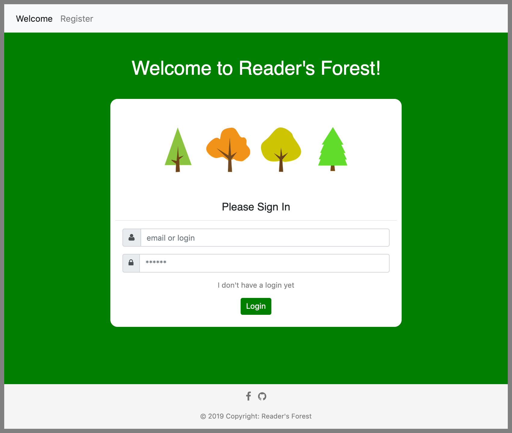
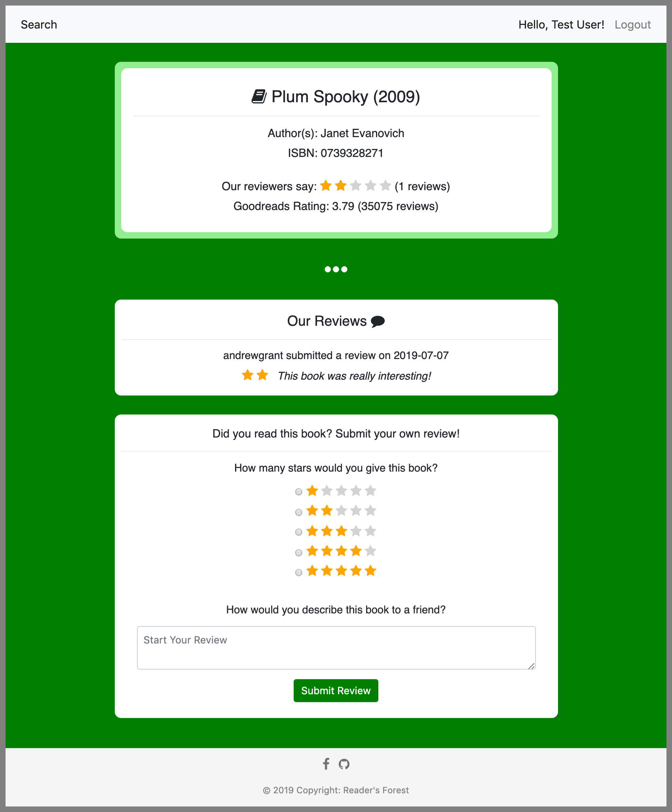

# Reader's Forest

## I. About

Reader's Forest is an interactive website that allows a user to both
search for books to read and review books already read, after both registering and logging to
their account. Reviews and ratings for books are sourced both from Reader's Forest users as 
well as from the Goodreads database, accessible via API. The project itself also offers 
several API endpoints that allow for developers to interact with the Reader's Forest database.

## II. User Navigation + Usage

The following outlines a user experience in Reader's Forest, with images captured from the
website pages for a fake user named `Test User`.

Users are directed first toward the login page and asked to register
for an account, if one does not exist. Registration requires (1) a login, 
(2) password, (3) first name and (4) last name in order to be approved. 

<p align="center">
  
</p>

Note that a fields must be filled and all usernames must be distinct. 
Once the registration is confirmed, users may successfully login to their account.

<p align="center">
  
</p>

Upon login, a user is directed toward a "search" page, where they can choose to
add a title, author, or isbn to the 'search' field to see a column of results.
These 'tiles' each represent a book, with some high level information about 
each book.

<p align="center">
  
</p>

If the user selects a given book, they're navigated toward the book page, where
they can see more information about the book, including the ratings and the
number of reviews from Goodreads, as well as any reviews that have been 
contributed by Reader's Forest users. They may also submit their own review, 
though user's are only permitted to have one review per book.

<p align="center">
  
</p>

User's can navigate back to the search page by selecting `Search` from the top
navigation bar. When finished with their session, user's may logout via the 
`Logout` option on the top navigation bar on the page.

## III. Components

### HTML + CSS
There are four central "pages" of the Reader's Forest site:
* Login (`login.html`)
* Register (`register.html`)
* Search (`search.html`)
* Book (`book.html`)

These pages all inherit a template format supported by the `layout.html` file,
which sets the navigation bar and footer of the site, and live within the `templates/` directory.

All formatting for the website is controlled by two stylesheets, found within `static/stylesheets`:
* `style.css`, edited as a CSS file
* `input.css`, generated from compiling changes made to the `input.scss` stylesheet.

Images used in this website can similarly be found under `static/img/`.

### Database
Data that supports the Reader's Forest site is stored in a Postgres database that was configured
using Heroku. Four database tables currently exist as part of this project:

* `users`: contains login, registration information about each user.
* `books`: contains information relevant to each book (note that books were sourced from an initial
"dump" of data into the database from the `books.csv` file found in this project).
* `book_reviews`: contains user ratings and reviews.
* `saved_books`: a table containing books saved for each user (note: this functionally is not fully implemented
for this release of this website, but functionality will be included in a future release).

Configurations of the database can be found in the `book_database.py` file of this repository.

### Flask

This website is supported by a python microframework called Flask, with routes configured
in this project's `application.py` file. 

As defined in this file, users can make `GET` requests from the following endpoints:
* `/`: redirects to the login or search pages, depending on session status.
* `/login`: allows a user to login to the site.
* `/logout`: where a user can see their logout page.
* `/register`: allows users to register for an account.
* `/search`: where a user may search for books, once already logged in.
* `/book/<isbn>`: where a user may lookup a book based on its isbn, once already logged in.

`POST` requests are also available from the `/login`, `/register`, `/book-review`, and `/search` routes, 
where data may be processed, retrieved, or added to the database.

### API

In order for others to be able to interact with the Reader's Forest database, three
API endpoints were made available for use with the Flask framework, all which accept `GET` requests and return 
`json`:
* `/api/<int:isbn>`: Returns all information for a book, based on the provided `isbn` number.
* `/api/<int:isbn>/author`: Returns only the author for a book, based on the provided `isbn`.
* `/api/<int:isbn>/year`: Returns only the year the book was published, based on the provided `isbn`.

These endpoints are defined in the `application.py` file of this repository.

### Goodreads API

In order to provide better reviews to users, data on Reader's Forest is also sourced
from Goodreads, popular book review website. Goodreads has a freely available and easily 
accessible API (read more here: https://www.goodreads.com/api), from which (1) average rating and (2) total
number of ratings for individual books was retrieved for the `/book/<isbn>` endpoint. 

This project's interaction with the Goodreads API is defined in the `goodreads.py` file of this
 repository. See more about how to setup access to Goodreads below.

## IV. Usage Locally

In order to deploy Reader's Forest locally, please follow the steps below.

#### Set up local python environment
Modules required for this project are outlined in `requirements.txt`. You may create a 
virtual environment with this requirements with the following commands:

(1) Create your virtual environment (venv):
```
$ python3 -m virtualenv venv
``` 

(2) Activate your venv:
```
$ source venv/bin/activate
```
(3) Install your requirements:
```
$ pip install -r requirements.txt
```

#### Set local variables
Running this project locally requires configuring several local environmental variables, 
including the following:

* `GOODREADS_API_KEY`: the API key acquired through the Goodreads website upon registration.
* `DATABASE_URL`: the full URI string accessible from the Settings/Database Credentials of 
the Heroku Postgres database page.

Additionally, it is helpful to set the following when using Flask:
* `FLASK_APP=application.py`: points Flask to `application.py` for routes
* `FLASK_ENV=development`: tells Flask to work in a dev setting, good for making changes.

#### Sass
When making changes to the `input.scss` file, be sure to recompile the file to `input.css` by
issuing the following command to tell Sass to watch and recompile this file as changes are made:
``` 
$ sass --watch input.scss:input.css
```

#### Run
See the website and changes by running Flask:
```
$ flask run
```
Please follow the resulting url printed by Flask in any browser.

## V. Developer Notes 
This project was developed on a Macbook (macOS Mojave) and was primarily tested in
Safari and Chrome.

### Future Releases
Future releases of Reader's Forest will make use of the `saved_books` database table to allow
users to be able to store individual books for later reading or review. These saved books will be 
available in an additional web page.

